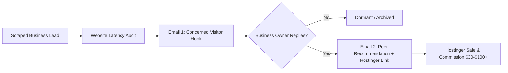
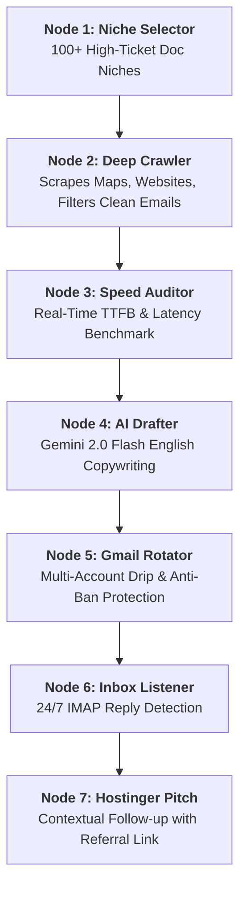

# ⚡ Hostinger Auto-Agent (v0.0.1.2)
### Autonomous 2-Step Soft Pitch Outreach & Affiliate Commission Engine

[](https://fastapi.tiangolo.com/)
[](https://python.org)
[](https://ai.google.dev/)
[](https://sqlite.org/)
[](LICENSE)

An end-to-end autonomous customer acquisition system engineered to generate **Hostinger Web Hosting affiliate commissions** on autopilot. Built with **FastAPI**, **Google Gemini 2.0 Flash**, **Multi-Gmail SMTP rotation**, and an **autonomous IMAP inbox listener**.

---

## 🎯 The Core Philosophy: Why the "2-Step Soft Pitch" Converts

Traditional cold emails pitching web services or affiliate links have less than a **1% conversion rate** and get flagged as spam instantly. 

**Hostinger Auto-Agent uses a conversational 2-step psychological funnel:**



### 1. Step 1 — The "Concerned Prospect" Hook (Zero Sales Pitch)
* **Goal**: Maximize open rate (~65%) and trigger a response.
* **Psychology**: The business owner receives a note from an everyday smartphone visitor saying their website took **3.8s to load** or timed out. Business owners are terrified of losing paying customers, so they almost always reply: *"Thanks for letting us know! Is it working now?"*
* **Safety**: 100% pure English, no marketing jargon, no links, zero spam filters triggered.

### 2. Step 2 — The "Peer Recommendation" Hostinger Pitch
* **Goal**: Close the affiliate referral sale naturally.
* **Psychology**: The agent thanks them for fixing it, mentions having identical server response lag on their own web projects, and casually recommends **Hostinger's LiteSpeed infrastructure**:
  > *"If your web developer ever looks into faster hosting, here's a direct discount link: [Your Referral Link] — no pressure at all, just wanted to share what solved our lag!"*
* **Result**: High-trust, peer-to-peer recommendation with zero sales friction.

---

## 🏗️ 7-Node Autonomous Architecture



| Node | Module | Role |
|---|---|---|
| **1. Niche Selector** | [`categories.py`](categories.py) | 100 verified high-ticket local business categories (Legal, Healthcare, Real Estate, Home Services). |
| **2. Deep Crawler** | [`scraper.py`](scraper.py) | Harvests businesses, extracts direct business emails, and aggressively eliminates junk (`support@wix.com`, `example@domain.com`, CDN assets). |
| **3. Speed Auditor** | [`auditor.py`](auditor.py) | Executes non-blocking HTTP HEAD/GET probes to measure authentic TTFB (Time to First Byte). |
| **4. AI Drafter** | [`ai_engine.py`](ai_engine.py) | Gemini 2.0 Flash / 1.5 Flash generates hyper-personalized, 100% English, non-spam cold hooks. |
| **5. Gmail Rotator** | [`email_engine.py`](email_engine.py) | Distributes sends across multiple Gmail accounts using App Passwords with random delays (180s-300s). |
| **6. Inbox Listener** | [`reply_listener.py`](reply_listener.py) | Background IMAP worker monitors incoming replies, matches threads, and updates state. |
| **7. Hostinger Pitch** | [`reply_listener.py`](reply_listener.py) | Automatically fires Email #2 containing your customized Hostinger referral URL. |

---

## 🖥️ Modern Dashboard & UI

Inspired by **Obsidian Canvas** and **Modern CRM Dashboards (Solo Vibe Theme)**:
* **Palette**: Ink Black (`#0c0c0c`), Solo Orange (`#E95722`), Soft Terracotta (`#F28A5B`), and Warm Cream (`#F7EBDD`).
* **Typography**: **Playfair Display** (Headings) + **Plus Jakarta Sans** (Body) + **JetBrains Mono** (Logs).
* **CRM Navigation**: Left sidebar with Workflow Canvas, Analytics & ROI, Leads & Threads, and Settings.
* **Live WebSocket Stream**: Real-time console terminal reflecting every scraping, auditing, and sending event.
* **Thread Inspector**: Full email thread visualizer showing received replies and sent pitches.
* **CSV Export**: One-click download of all verified business leads.

---

## 🚀 Quick Start Guide

### 1. Prerequisites
* **Python 3.10** or higher
* One or more Gmail accounts with **2-Step Verification** and **App Passwords** enabled.
* (Optional) Free Google Gemini API Key from [Google AI Studio](https://aistudio.google.com/).

### 2. Installation

```bash
# Clone the repository
git clone https://github.com/abhi478jeetur-rgb/Hostinger-referral-automation.git
cd Hostinger-referral-automation

# Install Python dependencies
pip install fastapi uvicorn requests beautifulsoup4
```

### 3. Launch the Application

```bash
python -m uvicorn server:app --host 127.0.0.1 --port 8000
```

Open your browser and navigate to:
```
http://127.0.0.1:8000
```

---

## ⚙️ Configuration & Setup

### 1. Connect Gmail Accounts (Anti-Ban Pool)
1. Go to **Google Account** → **Security** → **2-Step Verification**.
2. Scroll to the bottom and click on **App Passwords**.
3. Create an app password named `HostingerBot`. Google will give you a 16-character code (e.g., `abcd efgh ijkl mnop`).
4. In the app's **Settings tab**, enter your Gmail address and 16-character App Password, then click **Connect**.
5. Add 2 to 5 Gmail accounts. The engine will round-robin emails across all connected inboxes to keep daily volume safe (~20 emails/day per account).

### 2. Configure Hostinger Referral Link
1. In the **Settings tab**, enter your personal Hostinger Affiliate / Referral link:
   ```
   https://www.hostinger.com/in?REFERRALCODE=YOUR_CODE_HERE
   ```
2. Click **Save Configuration**. The engine will automatically update all outbound recommendation emails.

### 3. Add Gemini API Key (1,500 Free Requests/Day)
1. Get a free API key at [Google AI Studio](https://aistudio.google.com/).
2. Paste the key into the **Gemini API Key** field in the Settings tab.
> *Note: Even without an API key, the engine has built-in deterministic copywriting templates that convert out of the box.*

---

## 📊 Analytics & Expected ROI

Based on standard cold email benchmarks with a 5-account Gmail pool:

| Metric | Daily Volume | Monthly Volume (30 Days) |
|---|---|---|
| **Clean Scraped Leads** | ~100 | ~3,000 |
| **Hook Emails Sent (Step 1)** | 100 (20 per account) | 3,000 |
| **Estimated Replies (~10-15%)** | 10 – 15 | 300 – 450 |
| **Hostinger Pitches Delivered** | 10 – 15 | 300 – 450 |
| **Sales Conversion (~4%)** | ~0.5 sales/day | **12 – 20 Sales/month** |
| **Estimated Commission ($30/sale)** | ~$15/day | **$360 – $600/month (~₹30k - ₹50k)** |

---

## 🛡️ Anti-Spam & Deliverability Protections

* **Randomized Drip Intervals**: Outbound emails pause for 180 to 300 seconds between dispatches.
* **Strict Email Validation**: Automatically skips generic catch-alls, disposable addresses, image assets, and web builder footers.
* **100% English Output**: System prompts and fallback templates are hardcoded to output only natural, fluent English.
* **No Unsolicited Links in Email #1**: Referral links are **never** included in cold outreach — only sent after the client has replied and asked for advice.

---

## 📁 Repository Structure

```
Hostinger-referral-automation/
├── ai_engine.py        # Gemini 2.0 Flash prompt orchestrator & copy generator
├── auditor.py          # Real-time TTFB website speed measurement
├── categories.py       # 100 high-ticket local niche definitions
├── database.py         # SQLite schema, deduplication & sync engine
├── email_engine.py     # Multi-account SMTP round-robin sender
├── reply_listener.py   # Background IMAP inbox listener & auto-pitcher
├── scraper.py          # Local business crawler & email extractor
├── server.py           # FastAPI backend & WebSocket broadcaster
├── static/
│   ├── app.js          # Client UI logic, state management, analytics
│   ├── canvas.js       # Obsidian-inspired 7-node flow visualizer
│   ├── index.html      # CRM-style dashboard interface
│   └── style.css       # Solo Vibe orange palette design system
├── .gitignore          # Git exclusion rules for DB, env, caches
└── README.md           # Documentation
```

---

## ⚖️ Affiliate Compliance & Disclaimer

This software is an autonomous outreach assistant designed to adhere strictly to Hostinger's Affiliate Terms of Service:
* Does **not** engage in cookie stuffing or deceptive advertising.
* Does **not** bid on branded trademark keywords.
* Shares referral links transparently as peer-to-peer recommendations.

---

## 📄 License

Distributed under the MIT License. See `LICENSE` for more information.
